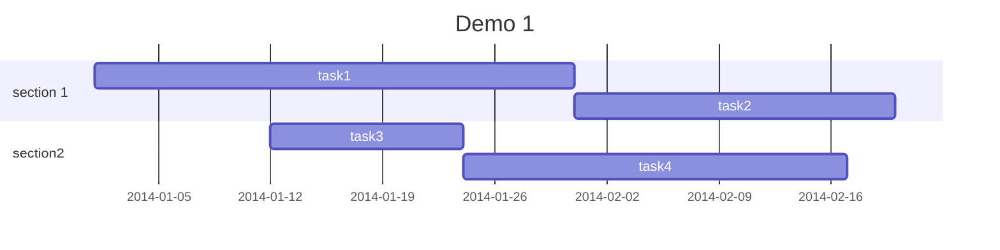

# Markdown 语法

# Heading 1
## Heading 2
### Heading 3
#### Heading 4
##### Heading 5

> Blockquotes

**Bold** *Italic* ***Bold And Italic*** ~~Delete Line~~ ==Highlight word== _Under Line_  --hide Text--

[Google](http://www.google.com)


- 19^tha^
- H~2~O

```js
function sayHello(){
    alert('Hello,Welcome To MarkMind')
}
```

 Emoji 图标 :smile::laughing: :heart_eyes: :kissing: :sweat::grin::sleeping::pensive::sob: :scream: :rage: :yum:

$$\displaystyle \frac{1}{\Bigl(\sqrt{\phi \sqrt{5}}-\phi\Bigr) e^{\frac25 \pi}} = 1+\frac{e^{-2\pi}} {1+\frac{e^{-4\pi}} {1+\frac{e^{-6\pi}} {1+\frac{e^{-8\pi}} {1+\cdots} } } }$$

@startuml
(*) --> "
{{
salt
{+
<b>an example
choose one option
()one
()two
[ok]
}
}}
" as choose
choose -right-> "
{{
salt
{+
<b>please wait
operation in progress
<&clock>
[cancel]
}
}}
" as wait
wait -right-> "
{{
salt
{+
<b>success
congratulations!
[ok]
}
}}
" as success
wait -down-> "
{{
salt
{+
<b>error
failed, sorry
[ok]
}
}}
"
@enduml



```flowchart
st=>start: Start|past:>http://www.google.com[blank]
e=>end: End|future:>http://www.google.com
op1=>operation: My Operation|past
op2=>operation: Stuff|current
sub1=>subroutine: My Subroutine|invalid
cond=>condition: Yes
or No?|approved:>http://www.google.com
c2=>condition: Good idea|rejected
io=>inputoutput: catch something...|future
st->op1(right)->cond
cond(yes, right)->c2
cond(no)->sub1(left)->op1
c2(yes)->io->e
c2(no)->op2->e
```